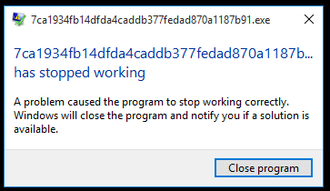

# DKHOS CTF reverse writeup


1. rev100 - Tamirci Pala Remzi

2. rev300 - Kambersiz düğün olmaz
	
3. rev400 - Kütüphanede kargaşa var


## rev100 - Tamirci Pala Remzi

Sorunun sonunda ikili sistemde kodlanmış bir veriyle karşılaşıyoruz.

```
0101100110011001011001101010101001011010101010100110010110101001011010011001011001100110010110100110100110010110011001011010011001100110101010100110101001011001011010011001011001100110100110010110100101010110011001011001010101100110101010100110101001011001011010011010101001101010100101100110100110010110011010011010010101100110010110100110100101010110011001010101100101100110101010100101100110011001
```

Aynı zamanda ipucu amaçlı bir video sunulmuş:

[https://www.youtube.com/watch?v=o_TKIM1vUEs](https://www.youtube.com/watch?v=o_TKIM1vUEs)

Linke tıkladığımızda karşımıza bir tatil rehberi firmasının tanıtım videosu çıkıyor. Burada dikkat çeken kısım videonun **Manchester** şehrini tanıtıyor olması. Principles of Computer Communication dersinden hatırladıklarımla _(İTÜ'ye selamlar)_ bunun **Manchester Code** yöntemine dair bir ipucu olduğunu farkettim.

[https://en.wikipedia.org/wiki/Manchester_code](https://en.wikipedia.org/wiki/Manchester_code)

En basit haliyle anlatmak gerekirse Manchester Code verinin 0'dan 1'e ve 1'den 0'a geçişler halinde kodlanmasıdır. Kodu çözmek için aşağıdaki linkte bulunan aracı kullandım:

[https://www.dcode.fr/manchester-code](https://www.dcode.fr/manchester-code)

Verinin decode edilmiş hali:

```
00101010010111110011111101001110011010010101001101101001010011010101111101110010011010010101101001100001010010000101111101110010011011110111100101101001011011000101001101100001010000100101111100101010
```

ASCII çıktısı:

```
*_?NiSiM_riZaH_royilSaB_*
```

Yazıyı ters çevirdiğimde bayrağa ulaşmış oldum:

```
*_BaSliyor_HaZir_MiSiN?_*
```

---

## rev300 - Kambersiz düğün olmaz

Soruda bir .exe dosyasıyla karşılaşıyoruz ancak çalıştırdığımızda runtime hatası alıyoruz.



Dosyayı IDA ile açtığımızda aşağıdaki kod ile karşılaşıyoruz:


VirtualAlloc ve memcpy fonksiyonlarından sonra "call eax" görünce bir unpacker ile karşı karşıya olduğumuz anlaşılıyor. ```call eax ``` üzerine breakpoint koyup debugger'ı başlatıyoruz. Daha sonra çağrılan kodları incelemeye koyuluyoruz. Bir iki ara instruction'dan sonra karşımıza veri üzerinde işlem yapan bir kod parçası çıkıyor:


İpucu olarak verilen 
[linke](https://raw.githubusercontent.com/EgeBalci/Amber/master/core/RC4.asm)
baktığımızda bu kodun RC4 decoder olduğunu anlıyoruz. Ancak kodda çok küçük bir hata var:


Verinin bittiği adresten (5B1E7h) payload uzunluğunu (5B17Ah) çıkardığımızda anahtar uzunluğunun 16 byte olduğunu görüyoruz. Kaynak kodunda

```nasm
  	and dl,KSize-1			; dl & sizeof(Key)
```

olarak verilen değerin bizim kodumuzda 15(Fh) olmasını beklerken 16(10h) olduğunu görüyoruz. Bu hatayı düzeltip kodu çalıştırdığımızda karşımıza bayrak çıkıyor:


```
DKHOS_{4ask1m_N0lur_G3r1_d0n_!}
```

## rev400 - Kütüphanede kargaşa var

Soruda bir DLL dosyası sunuluyor. Bu dosyayı IDA ile incelediğimizde karşımıza aşağıdaki fonksiyonlar çıkıyor:


DllMain fonksiyonuna baktığımızda işe yarar hiçbir şey yapmadığını ve 0Ah değerini döndürdüğünü görüyoruz. Diğer fonksiyonlara baktığımızda ise hepsinin çok benzer olduğunu görüyoruz:


a'dan z'ye tüm fonksiyonlar bu yapıya sahip. Sol taraftaki döngü tüm fonksiyonlarda aynı ve stack'de bulduğu bir çöp değeri alıp bir takım işlemlere tabi tutuyor. Ancak sonuçta elde kalan değerle alakalı hiçbir işlem yapılmıyor. Kodun dikkat dağıtmak için oraya koyulduğunu düşünüyorum. Ayrıca sol tarafın ne kadar uzun olduğunu göstermek amaçlı şöyle bir görüntü de paylaşayım:


Soldaki dalı 33(21h) kere çalıştırdıktan sonra bir fonksiyonların bir kısmı ekrana bir karakter bastırırken kalanlar ise bastırmıyor. Dikkat çeken diğer bir nokta ise fonksiyonların farklı farklı değerler döndürmesi. Yayınlanan ipucunu soruyu çözene kadar tam olarak anlayamamış olmamdan dolayı, ipucunda belirtilen fonksiyonların nümerik değerlerini, fonksiyonların bastırdığı karakterleri ve döndürdüğü değerleri bir tablo haline getirdim:

|ord| Fonksiyon | return değeri | printf |
| --- | --------- |:--------------|:-------|
|1| DllMain | 10 | - |
|| b,c,e,h,n,p,r,t | 0 | - |
|2| a | 22 | "e" |
|5| d | -1 | "d" |
|7| f | 11 | "s" |
|8| g | 21 | "s" |
|10| i | 16 | "L" |
|11| j | 19 | "4" |
|12| k |  8 | "T" |
|13| l | 14 | "L" |
|14| m | 5  | "R" |
|16| o | 12 | "e" |
|19| s | 2  | "v" |
|21| u | 7  | "_" |
|22| v | 23 | "_" |
|23| y | 24 | "W" |
|24| z | 13 | "o" |

Bu tabloyla saatlerce karşılıklı bakıştıktan sonra return değerleri ile ord değerleri arasında bir bağıntı fark ettim: Fonksiyonların return değerleri printf kullanan fonksiyonların nümerik değerlerine denk geliyor. Buradan fonksiyonların bir zincir oluşturduğunu anlayıp harfleri DllMain'den itibaren sıraya dizdim. Ve bayrak karşımdaydı:

```
LeTs_s4ve_WoLRd
```

Bayrağı bulduktan sonra fonksiyonları recursive olarak DllMain'den itibaren çağırabileceğimi keşfedince bunu bir programla da yapmak istedim.

```c
#include <stdio.h>
#include <windows.h>

typedef UINT (CALLBACK* dynamic_function)();

int recursive_call(HINSTANCE hDLL, int ord) {
    dynamic_function letter = (dynamic_function)GetProcAddress(hDLL, ord);
    if (!letter) {
        FreeLibrary(hDLL);
        return -1;
    } else {
        int ret = letter();
        if (ret != -1) {
            return recursive_call(hDLL, ret);
        } else {
            return 0;
        }
    }
}

int main()
{
    HINSTANCE hDLL;
    UINT  ret;

    hDLL = LoadLibrary("rev400.dll");
    if (hDLL != NULL) {
        return recursive_call(hDLL, 1);
    }
    return -2;
}
```

Programı çalıştırdığımda konsolda bayrakla karşılaştım:


